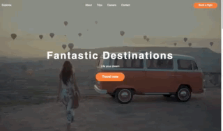

# Explorox-sample-site
## Goal
- This site is meant to be a starter project to understand and improve the workflows in react and gatsby. 
- Fully responsive

## Result
#### Desktop Landing Page

#### Mobile Landing Page

## Tools & Libraries used
- React
- Gatsby
- Gatsby-Image
- styled Components
- GraphQl
- Aos

## Learnings
### Improved: 
- Break a Website down in Components (incl. low level Components)
- React props usage 
- State usage
- Basic workflows & structures

### New:
- Usage of Styled components
- Auto-fit Images with GraphQl & Gtasby-Image
- Parallax effects with AOS
- Git is case insensitive when it comes to filenames -> checking git repo & using git mv <oldFilename> <newFilename> does the trick here
- Case insensitivity can lead to deployment-errors

## Next Steps
- Improve generic structure of components
- Improve State usage
- Expand component library
- Get used to more animation libraries like React Spring
